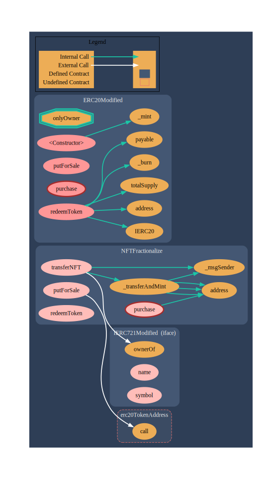

# Fractional NFT

## Overview
The Fractional NFT project is a Solidity smart contract that facilitates fractional ownership, lending, and redemption of non-fungible tokens (NFTs) on the Ethereum blockchain. It allows users to tokenize an NFT and mint ERC20 tokens that represent fractions of the NFT. These ERC20 tokens can be traded, lent, and redeemed for a proportional share of the NFT's value.

## Features
- Fractionalize NFTs: Transfer an NFT to the contract and mint ERC20 tokens representing fractions of the NFT.
- NFT Lending: Users can lend their NFT fractions to others and earn interest.
- Peer-to-Peer Trading: Fractional NFTs can be traded on a peer-to-peer basis, allowing users to buy and sell NFT fractions directly.
- Redemption: Redeem ERC20 tokens for a proportional share of the NFT's value when the NFT is sold.

## Prerequisites
- Solidity ^0.8.0
- OpenZeppelin Contracts: ERC721, ERC20, ERC721Holder, ERC20Permit, Ownable

## Installation
1. Install the required dependencies:\
   `npm install @openzeppelin/contracts`
2. Run the Test by:\
    `npx hardhat test`

## Usage
1. Deploy the Fractional_NFT contract to an Ethereum network, providing the address of the target ERC721 contract.
2. Interact with the contract using the following functions:&nbsp;
    - `transferNFT`: Transfer an NFT to the contract and mint ERC20 tokens to the owner.
    - `putForSale`: Put the fractional NFT up for sale at a specified price.
    - `purchase`: Purchase the fractional NFT by paying the sale price.
    - `redeemToken`: Redeem ERC20 tokens for a proportional share of the sale price.

## Acknowledgements
- This contract is built using [**OpenZeppelin**][OpenZeppelin] libraries.

[OpenZeppelin]: https://github.com/OpenZeppelin